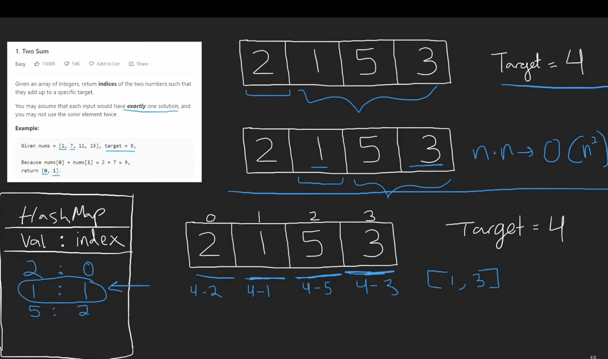

#### Task

<br />

Given an array of integers, return indices of the two numbers such that they add up to a specific target.

You may assume that each input would have exactly one solution, and you may not use the same element twice.

<br />

#### Example:

<br />

Given nums = [2, 7, 11, 15], target = 9,

Because nums[0] + nums[1] = 2 + 7 = 9,
return [0, 1].

#### Explanation:

<br />



#### What to consider:

Questions about inputs:

- Is it a sorted array?
- Are all the elements of the array integers? Could they be negative?
- Can the same number be repeated?

Questions about outputs:

- Is the output a boolean or should I be returning the indices of the found numbers?
- Is there only one combination of elements that summed up are equal to the target?

Questions about the value of the problem:

- What’s the main goal, space or time?
- Are there any constraints in using extra space?

#### Code

##### Brute force solution

```
var twoSum = function(nums, target) {
    for (let i = 0; i < nums.length; i++) {
        for (let j = i + 1; j < nums.length; j++) {
            if(target === nums[i] + nums[j]) {
                return [i, j]
            }
        }
    }
};

twoSum([2,7,11,15], 9)
```

#### Optimized solution using hash map to hold values

```
var twoSum = function(nums, target) {
    // the purpose of the object is to store the numbers we have seen and the indexes they appear at
    const seenNums = {};
    for (let i = 0; i < nums.length; i++) {
        let n = nums[i];
        // amount needed to add to the current number to get to the target
        // if the number has already been added to the object, return its index (saved in the object) and the current index
        if(seenNums[target - n] !== undefined) {
            return [seenNums[target - n], i]
        }
        // if the number has not been seen yet, add it to the object
        seenNums[n] = i;
    }
    return [];
};

twoSum([2,7,11,15], 9)
```
